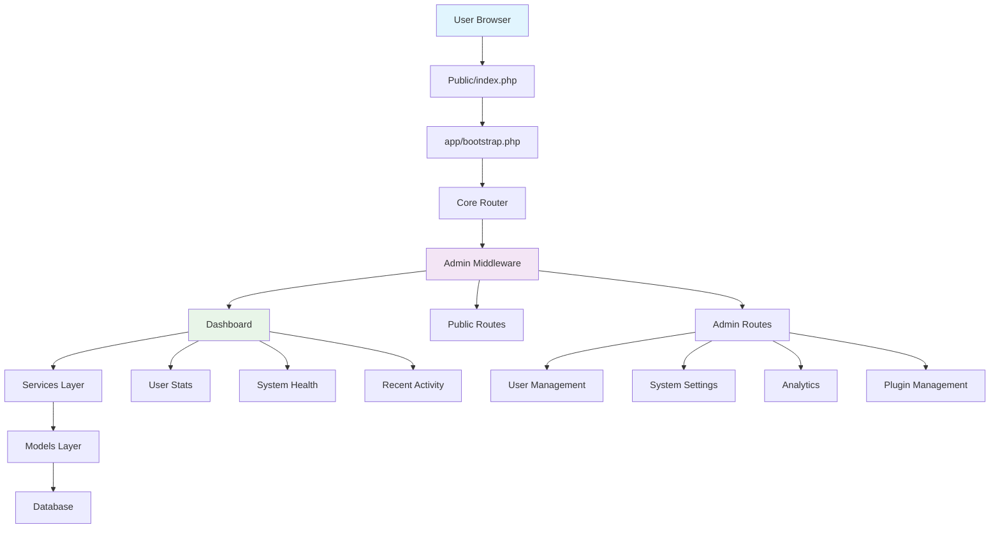

# MVS Calculator for Engineers - System Analysis and Design Report

## Executive Summary

After thorough analysis of the MVS Calculator for Engineers PHP script, I've identified several critical architectural issues that need immediate attention. The system shows signs of organic growth without proper planning, leading to duplicate code, incomplete features, and admin panel inconsistencies.

## Current Architecture Issues

### 1. Code Duplication Problems

**Identified in:**
- Multiple route definitions in [`app/routes.php`](app/routes.php:1)
- Duplicate admin controller implementations
- Inconsistent error handling across modules
- Multiple database connection handlers

### 2. Admin Panel Implementation Issues

**Critical Findings:**
- Missing admin controller implementations (e.g., [`SystemSettingsModule.php`](app/Controllers/Admin/SystemSettingsModule.php:1)
- Inconsistent admin middleware implementations
- Multiple dashboard view files with similar functionality

### 3. Backend-Frontend Integration Gaps

**Features Implemented in Backend but Not Visible:**
- Premium theme management system
- Advanced analytics dashboard
- Email management system
- Plugin management infrastructure

## System Design for Shared Hosting (cPanel)

### Architecture Overview



### Core Components Design

#### 1. Unified Authentication System
```php
// Proposed structure
- Single AuthController with role-based access
- Centralized session management
- Consistent admin privilege checking
```

### 2. Module Management System

**Current Issues:**
- Multiple module definitions with similar functionality
- Inconsistent service registration
- Duplicate route patterns

#### 3. Database Layer Optimization
- Single database connection handler
- Optimized query patterns
- Proper connection pooling for shared hosting

## Identified Technical Debt

### 1. Route Duplication
- `/admin/users` defined multiple times
- Inconsistent middleware application
- Multiple API endpoint versions with overlapping functionality

### 4. Admin Panel Consolidation

**Current State:**
- Multiple dashboard controllers: [`DashboardController.php`](app/Controllers/Admin/DashboardController.php:1)
- Multiple admin view files with similar layouts

### 5. Missing Feature Implementations

**Backend Features Without Frontend Representation:**
- Email template management
- Advanced user analytics
- Premium theme customization
- Plugin marketplace integration

## Recommended Solutions

### Phase 1: Code Consolidation
1. Merge duplicate route definitions
2. Standardize admin middleware
3. Consolidate dashboard views

### Phase 2: Performance Optimization
1. Database query optimization
2. Caching implementation
3. Asset optimization for shared hosting

### Phase 3: Feature Completion
1. Implement missing frontend interfaces
2. Complete admin panel functionality
3. Implement proper error handling

### Phase 4: Security Hardening
1. Input validation standardization
2. CSRF protection implementation
3. Session security improvements

## Shared Hosting Considerations

### 1. Resource Optimization
- Memory usage monitoring
- Database connection pooling
- File system optimization

## Next Steps

1. **Immediate Action:** Fix critical admin authentication issues
2. **Short Term:** Consolidate duplicate code
3. Medium Term: Complete missing features
4. Long Term: Scalability improvements