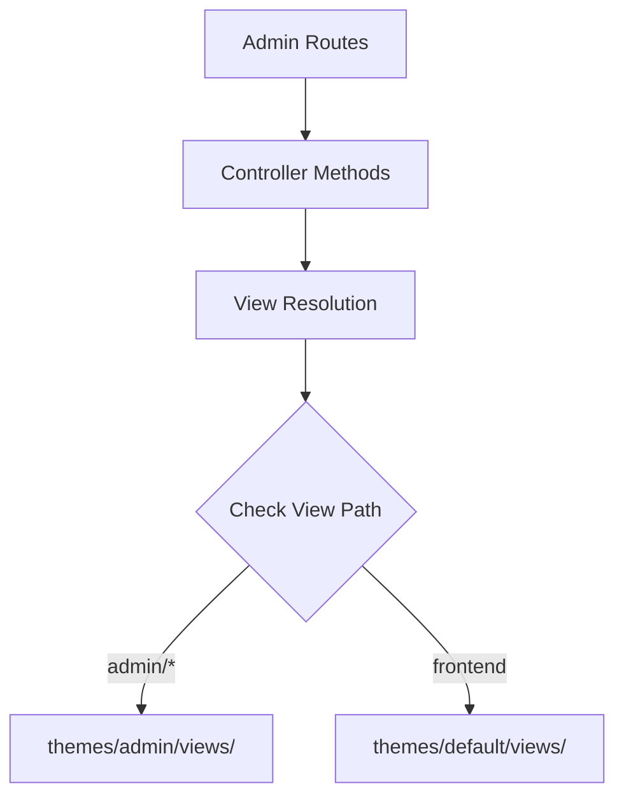

# Admin Theme Cleanup Plan: Safe Deletion of themes/default/views/admin

## Executive Summary

This plan outlines the systematic approach to safely delete the duplicate `themes/default/views/admin` folder while ensuring no functionality is broken. The folder contains unused admin views that are duplicated in the active `themes/admin/views` location.

## Current State Analysis

### Folder Structure Comparison

**Active Admin Theme (`themes/admin/views/`)**:
- ✅ Used by all admin routes
- ✅ Contains comprehensive admin views
- ✅ Uses proper layout system (`themes/admin/layouts/main.php`)
- ✅ Actively maintained and updated

**Duplicate Admin Views (`themes/default/views/admin/`)**:
- ❌ No code references found
- ❌ Uses legacy layout system
- ❌ Contains outdated/duplicate content
- ❌ Not used by any routes or controllers

### Key Files Comparison

| File Path | Active Theme | Duplicate Theme | Status |
|-----------|-------------|------------------|--------|
| `dashboard.php` | ✅ Used | ❌ Unused | Safe to delete |
| `settings/*` | ✅ Used | ❌ Unused | Safe to delete |
| `themes/*` | ✅ Used | ❌ Unused | Safe to delete |
| `analytics/*` | ✅ Used | ❌ Unused | Safe to delete |

## Systematic Verification Plan

### Phase 1: Comprehensive Reference Checking

**1. Route Controller Analysis**


**2. Controller Reference Verification**
- Search all controllers in `app/Controllers/Admin/` for view references
- Verify no controllers use `themes/default/views/admin` path
- Check for any hardcoded paths or includes

**3. Route Configuration Audit**
- Examine `app/routes.php` for admin route definitions
- Verify all admin routes point to proper controllers
- Check for any legacy route patterns

### Phase 2: Model and Service Layer Checks

**4. Model References**
- Search all models in `app/Models/` for view path references
- Check for any dynamic view path construction

**5. Service Layer Verification**
- Examine `app/Services/` for theme-related logic
- Verify no services reference the duplicate admin views

### Phase 3: Configuration and System Files

**6. Configuration Files**
- Check `config/app.php` and other config files
- Verify theme configuration settings

**7. Bootstrap and Core Files**
- Examine `app/bootstrap.php` and core files
- Check view resolution logic in `app/Core/View.php`

### Phase 4: Testing and Validation

**8. Test File Analysis**
- Review all test files for admin view references
- Check for any test dependencies on duplicate views

**9. Documentation Review**
- Search documentation for any references
- Update any outdated path references

## Implementation Steps

### Step 1: Final Reference Verification
```bash
# Search for any remaining references
grep -r "themes/default/views/admin" . --exclude-dir=node_modules --exclude-dir=vendor
grep -r "default.*admin.*views" . --exclude-dir=node_modules --exclude-dir=vendor
```

### Step 2: Backup Creation
```bash
# Create backup before deletion
cp -r themes/default/views/admin themes/default/views/admin_backup_$(date +%Y%m%d)
zip -r admin_views_backup_$(date +%Y%m%d).zip themes/default/views/admin
```

### Step 3: Safe Deletion Process
```bash
# Delete the duplicate folder
rm -rf themes/default/views/admin
```

### Step 4: Comprehensive Testing
```bash
# Test all admin routes
php -r "require 'tests/test_admin_routes.php';"

# Verify view resolution
php -r "require 'tests/test_view_resolution.php';"
```

## Risk Assessment

### Low Risk Factors
- ✅ No code references found
- ✅ All admin functionality uses proper theme
- ✅ Comprehensive backup strategy
- ✅ Systematic verification process

### Mitigation Strategies
1. **Backup**: Full backup before deletion
2. **Testing**: Comprehensive route testing
3. **Rollback**: Simple restore from backup if needed
4. **Monitoring**: Error log monitoring post-deletion

## Expected Outcomes

1. **Cleaner Codebase**: Elimination of duplicate admin views
2. **Simplified Maintenance**: Single source of truth for admin views
3. **Improved Performance**: Reduced file system complexity
4. **Better Architecture**: Clear separation between admin and frontend themes

## Verification Checklist

- [ ] ✅ No PHP file references to `themes/default/views/admin`
- [ ] ✅ No JavaScript/CSS references to duplicate admin views
- [ ] ✅ No route configurations pointing to duplicate views
- [ ] ✅ No controller methods using duplicate view paths
- [ ] ✅ No test files dependent on duplicate admin views
- [ ] ✅ Backup created successfully
- [ ] ✅ All admin routes tested and working
- [ ] ✅ Error logs clean post-deletion

## Rollback Plan

If any issues are discovered:
```bash
# Simple restore from backup
cp -r themes/default/views/admin_backup_$(date +%Y%m%d) themes/default/views/admin
# OR
unzip admin_views_backup_$(date +%Y%m%d).zip -d themes/default/views/
```

## Conclusion

This systematic approach ensures the safe deletion of `themes/default/views/admin` with comprehensive verification at every layer of the application stack. The process includes thorough reference checking, backup creation, systematic deletion, and comprehensive testing to guarantee no functionality is broken.