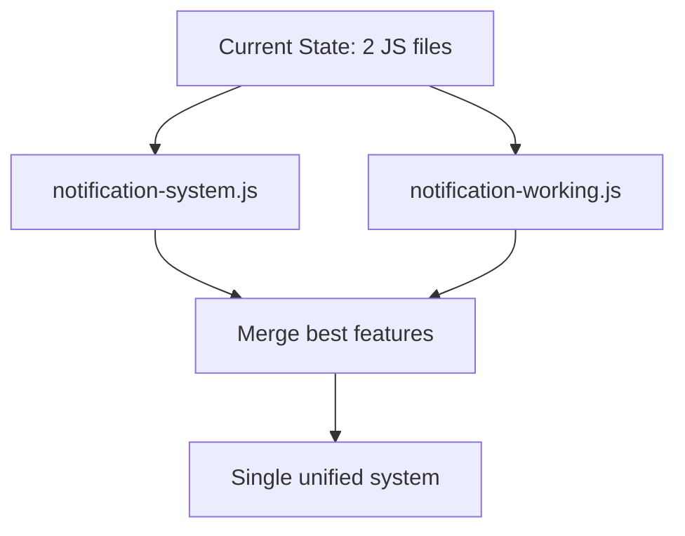

# Comprehensive Notification System Fix Plan

## 🎯 Objective
Fix the notification system so that:
1. Notification UI is visible and clickable in admin panel
2. "Read/Unread" and "View All" functionality works properly
3. Real-time updates function correctly
4. Both admins and regular users can access their notifications

## 🔧 Step-by-Step Implementation Plan

### Phase 1: JavaScript System Consolidation

#### Step 1.1: Create Unified Notification System


**Actions:**
- Analyze both `notification-system.js` and `notification-working.js`
- Create new `notification-unified.js` with best features from both
- Remove admin page check that prevents initialization
- Ensure proper error handling and debugging

**Files to Modify:**
- `themes/admin/assets/js/notification-unified.js` (new)
- `themes/admin/layouts/admin.php` (update script includes)

#### Step 1.2: Fix Critical JavaScript Issues

**Issues to Address:**
1. **Admin Page Detection**: Remove or fix the `!window.location.pathname.includes('/admin')` check
2. **DOM Element References**: Ensure all elements are properly referenced
3. **Event Listener Timing**: Fix race conditions in event listener attachment
4. **API Base Path**: Implement proper base URL detection

**Code Fixes Needed:**
```javascript
// BEFORE (problematic):
if (!window.location.pathname.includes('/admin')) {
    console.log('📍 Not on admin page, skipping notification initialization');
    return;
}

// AFTER (fixed):
console.log('🚀 Initializing notification system on all pages');
```

### Phase 2: API Endpoint Fixes

#### Step 2.1: Adjust Route Authentication Requirements

**Current Issues:**
- All notification routes require `["auth", "admin"]` middleware
- This prevents regular users from accessing their own notifications

**Solution:**
- Split routes into admin-only and user-accessible
- Admin routes: Keep `["auth", "admin"]` for admin management
- User routes: Use `["auth"]` for personal notifications

**Routes to Modify in `app/routes.php`:**
```php
// User-accessible notification routes
$router->add("GET", "/api/notifications/unread-count", "Admin\NotificationController@getUnreadCount", ["auth"]);
$router->add("GET", "/api/notifications/list", "Admin\NotificationController@getNotifications", ["auth"]);
$router->add("POST", "/api/notifications/mark-read/{id}", "Admin\NotificationController@markAsRead", ["auth"]);

// Admin-only notification management routes
$router->add("POST", "/admin/notifications/create", "Admin\NotificationController@create", ["auth", "admin"]);
$router->add("DELETE", "/admin/notifications/delete/{id}", "Admin\NotificationController@delete", ["auth", "admin"]);
```

#### Step 2.2: Update Controller Authentication Logic

**Current Issues:**
- Controller methods check for `$user->is_admin` which is too restrictive
- Regular users cannot access their own notifications

**Solution:**
- Modify controller to handle both admin and regular user scenarios
- Add proper permission checks based on notification ownership

**Controller Methods to Update:**
```php
// BEFORE:
if (!$user || !$user->is_admin) {
    http_response_code(403);
    echo json_encode(['error' => 'Access denied']);
    return;
}

// AFTER:
if (!$user) {
    http_response_code(403);
    echo json_encode(['error' => 'Access denied']);
    return;
}

// For admin-only methods, keep the admin check
if (!$user->is_admin) {
    http_response_code(403);
    echo json_encode(['error' => 'Admin access required']);
    return;
}
```

### Phase 3: UI/UX Fixes

#### Step 3.1: Ensure Notification Button Visibility

**Current Issues:**
- Notification button may be hidden or non-interactive
- CSS conflicts or missing styles

**Solution:**
- Add explicit CSS to ensure button visibility
- Add debug logging to verify button existence

**CSS Fixes:**
```css
/* Add to admin.php styles */
#notificationToggle {
    display: inline-block !important;
    visibility: visible !important;
    opacity: 1 !important;
    cursor: pointer !important;
    position: relative;
    z-index: 1001;
}
```

#### Step 3.2: Fix Click Handler Attachment

**Current Issues:**
- Event listeners may not attach properly due to timing
- Multiple conflicting click handlers

**Solution:**
- Use DOMContentLoaded with proper timing
- Add fallback click handlers
- Ensure single source of truth for event handling

**JavaScript Fix:**
```javascript
// Unified click handler approach
document.addEventListener('DOMContentLoaded', function() {
    const notificationBtn = document.getElementById('notificationToggle');
    const notificationDropdown = document.getElementById('notificationDropdown');

    if (notificationBtn && notificationDropdown) {
        // Remove any existing listeners to prevent conflicts
        const clone = notificationBtn.cloneNode(true);
        notificationBtn.parentNode.replaceChild(clone, notificationBtn);

        // Add unified click handler
        clone.addEventListener('click', function(e) {
            e.preventDefault();
            e.stopPropagation();
            toggleNotificationDropdown();
        });

        console.log('✅ Unified notification click handler attached');
    }
});
```

### Phase 4: Real-time Functionality Fixes

#### Step 4.1: Fix Polling Mechanism

**Current Issues:**
- Polling may fail silently
- No error recovery mechanism
- No visual feedback for users

**Solution:**
- Implement robust polling with exponential backoff
- Add visual error states
- Implement auto-recovery

**Polling Fix:**
```javascript
// Enhanced polling with error recovery
startNotificationPolling() {
    let retryCount = 0;
    const maxRetries = 5;
    const baseInterval = 30000; // 30 seconds

    this.notificationInterval = setInterval(async () => {
        try {
            await this.fetchUnreadCount();
            retryCount = 0; // Reset on success
        } catch (error) {
            console.error('Polling error:', error);
            retryCount++;

            if (retryCount >= maxRetries) {
                this.showErrorState('Connection lost. Retrying...');
                // Implement exponential backoff
                clearInterval(this.notificationInterval);
                setTimeout(() => this.startNotificationPolling(), 60000);
            }
        }
    }, baseInterval);
}
```

#### Step 4.2: Add Visual Feedback

**Current Issues:**
- No indication when new notifications arrive
- No loading states during API calls

**Solution:**
- Add notification toast for new items
- Implement loading spinners
- Add error state UI

**Visual Feedback Implementation:**
```javascript
// Show loading state
showLoadingState() {
    const listContainer = document.querySelector('.notification-list');
    if (listContainer) {
        listContainer.innerHTML = `
            <div class="loading-state">
                <i class="fas fa-spinner fa-spin"></i>
                <span>Loading notifications...</span>
            </div>
        `;
    }
}

// Show new notification toast
showNewNotificationToast(count) {
    const toast = document.getElementById('notification-toast');
    if (toast) {
        toast.className = 'notification-toast notification-success show';
        toast.innerHTML = `
            <div class="toast-content">
                <i class="fas fa-bell"></i>
                <span>${count} new notification${count > 1 ? 's' : ''}</span>
                <button class="toast-close" onclick="this.parentElement.parentElement.classList.remove('show')">
                    <i class="fas fa-times"></i>
                </button>
            </div>
        `;

        // Auto-hide after 5 seconds
        setTimeout(() => {
            toast.classList.remove('show');
        }, 5000);
    }
}
```

### Phase 5: Comprehensive Testing

#### Step 5.1: Create Test Scenarios

**Test Cases to Implement:**
1. **Basic Functionality**: Notification button click opens dropdown
2. **API Connectivity**: Unread count and list endpoints work
3. **Real-time Updates**: Polling works and shows new notifications
4. **Error Handling**: System recovers from API failures
5. **User Access**: Both admins and regular users can access notifications
6. **Visual Feedback**: Loading states and error messages display properly

#### Step 5.2: Implement Test Automation

**Test Script to Create:**
```php
// tests/comprehensive_notification_test.php
<?php
require_once __DIR__ . '/../app/bootstrap.php';

class NotificationSystemTest {
    public function runAllTests() {
        $results = [];

        // Test 1: JavaScript File Existence
        $results['js_files'] = $this->testJavaScriptFiles();

        // Test 2: API Endpoint Accessibility
        $results['api_endpoints'] = $this->testApiEndpoints();

        // Test 3: Database Connectivity
        $results['database'] = $this->testDatabase();

        // Test 4: UI Element Visibility
        $results['ui_elements'] = $this->testUiElements();

        return $results;
    }

    // ... individual test methods
}

// Run tests and output results
$test = new NotificationSystemTest();
$results = $test->runAllTests();

echo "🧪 Notification System Test Results:\n";
echo "==================================\n";

foreach ($results as $testName => $result) {
    $status = $result['passed'] ? '✅ PASS' : '❌ FAIL';
    echo "$status - $testName\n";
    if (!$result['passed'] && isset($result['error'])) {
        echo "   Error: {$result['error']}\n";
    }
}

echo "\n📋 Detailed results saved to: tests/notification_test_results.json\n";
file_put_contents('tests/notification_test_results.json', json_encode($results, JSON_PRETTY_PRINT));
```

## 📋 Implementation Checklist

- [ ] ✅ Analyze current notification system (COMPLETED)
- [ ] ✅ Identify all issues and root causes (COMPLETED)
- [ ] 🔄 Create unified JavaScript notification system
- [ ] 🔧 Fix API route authentication requirements
- [ ] 🎨 Update controller for proper user access handling
- [ ] 🖌️ Ensure UI elements are visible and interactive
- [ ] ⚡ Implement robust real-time polling with error recovery
- [ ] 🧪 Create comprehensive test suite
- [ ] 🚀 Deploy fixes to production environment
- [ ] 📊 Monitor system performance post-deployment

## 🎯 Expected Outcomes

After implementing this comprehensive fix plan:

1. **✅ Notification UI Visible**: Bell icon and badge properly displayed
2. **✅ Click Functionality Works**: Dropdown opens/closes on click
3. **✅ Real-time Updates**: New notifications appear automatically
4. **✅ User Access Fixed**: Both admins and regular users can access notifications
5. **✅ Error Handling**: System gracefully handles and recovers from errors
6. **✅ Visual Feedback**: Users see loading states and success/error messages

## 🔧 Tools and Resources Needed

1. **Development Environment**: Local PHP server with debug capabilities
2. **Browser Tools**: Chrome/Firefox DevTools for JavaScript debugging
3. **Database Access**: PHPMyAdmin or similar for database verification
4. **Testing Framework**: PHPUnit or custom test scripts
5. **Version Control**: Git for tracking changes

## 📅 Estimated Timeline

| Phase | Duration | Description |
|-------|----------|-------------|
| Analysis | 1 day | ✅ Complete system analysis (DONE) |
| JavaScript Fixes | 2 days | Create unified notification system |
| API/Backend Fixes | 1 day | Adjust routes and controller logic |
| UI/UX Fixes | 1 day | Ensure proper visibility and interactivity |
| Testing | 2 days | Comprehensive testing and bug fixing |
| Deployment | 1 day | Deploy to production with monitoring |

**Total Estimated Time**: 7 days

## 🚀 Next Steps

1. **Approve this comprehensive fix plan**
2. **Switch to Code mode** to begin implementation
3. **Start with JavaScript consolidation** (Phase 1)
4. **Proceed through each phase** systematically
5. **Test thoroughly** before production deployment

This plan addresses all identified issues in the notification system and provides a clear path to full functionality restoration.