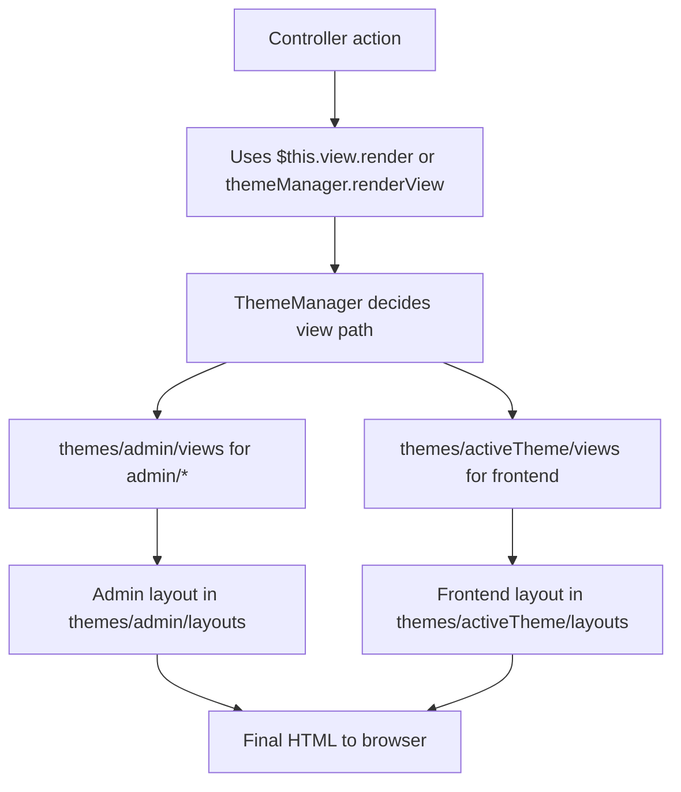

Here is a concrete, implementation-ready plan to achieve your goal:

> Delete [`app/Views`](app/Views) and update all references so views are served from `themes/admin/views` (and other theme paths), without breaking frontend or admin.

---

## 1. Current rendering model (short recap)

From [`Controller`](app/Core/Controller.php:4) and [`View`](app/Core/View.php:4):

- `Controller::view($view, $data)`:
  - Directly includes `__DIR__ . '/../Views/' . str_replace('.', '/', $view) . '.php'`
  - Ignores themes entirely
  - Is the main blocker for deleting [`app/Views`](app/Views).

- `View::render($view, $data)`:
  - If `$view` starts with `admin/`:
    - Looks in `BASE_PATH . "/themes/admin/views/" . substr($view, 6) . ".php"`
    - Falls back to `BASE_PATH . "/app/Views/" . $view . ".php"`
  - Else (non-admin):
    - Delegates to `ThemeManager::renderView($view, $data)` which uses the active theme and then falls back to [`app/Views`](app/Views).
  - Wraps content in theme/layouts with multiple fallbacks (theme layout → admin layout → app/Views layouts).

Controllers already use `$this->view->render()` extensively (including many frontend controllers), so the main remaining risks are:

- Any remaining use of `$this->view()` (Controller::view).
- Any fallback paths in `View::render()` or `ThemeManager` that still expect files in [`app/Views`](app/Views).

---

## 2. Target architecture after migration

### 2.1. High-level goals

1. **All controllers** must render via `View::render()` (or `ThemeManager`), not via `Controller::view()`.
2. **All view files** must live under:
   - `themes/admin/views/...` for admin-specific views
   - `themes/<active-theme>/views/...` for frontend views (or a chosen default theme)
3. **No required fallbacks** to [`app/Views`](app/Views) in:
   - [`View::render`](app/Core/View.php:44)
   - [`ThemeManager`](app/Services/ThemeManager.php) (not shown here but implied).
4. Once verified, [`app/Views`](app/Views) can be safely deleted.

### 2.2. Rendering flow after refactor



No step should require [`app/Views`](app/Views) anymore.

---

## 3. Reference-update strategy

You asked specifically to:

> delete `app\Views` and update all the reference to `themes/admin/view` like that.

Given the current design, the safest and cleanest strategy is:

1. **Do not hardcode `themes/admin/views` in controllers.**
   - Keep controllers calling `$this->view->render('something/path', $data);`
   - Let `View::render` and `ThemeManager` decide the actual filesystem path.
2. **Instead, ensure that for every `$this->view->render('x/y', ...)` call:**
   - There is a corresponding `x/y.php` in:
     - `themes/admin/views/...` for admin views (`admin/*`)
     - `themes/<active-theme>/views/...` for frontend views.

This preserves flexibility (themes) and keeps controllers clean, while still allowing you to delete [`app/Views`](app/Views) once all fallbacks are removed or made non-essential.

---

## 4. Concrete refactor plan

### Step 1 – Eliminate all uses of `Controller::view()`

1. Search for `$this->view(` that is **not** `$this->view->render(`:
   - You already have a broad search; we will specifically:
     - Replace any `protected function someAction() { $this->view('path', $data); }`
     - With `$this->view->render('path', $data);`
2. For any `layout()` usages in [`Controller`](app/Core/Controller.php:58):
   - Either:
     - Replace with theme-aware layouts via `View::render` (preferred).
     - Or remove if unused (we should confirm usage via search).

**Result:** No controller will depend on `app/Views` directly.

### Step 2 – Normalize view paths vs filesystem

For each controller pattern from your `search_files` result:

- **Admin controllers** (paths starting with `admin/`):
  - Example: [`Admin/DashboardController`](app/Controllers/Admin/DashboardController.php) uses:
    - `$this->view->render('admin/dashboard', ...)`
  - Ensure the file exists at:
    - `themes/admin/views/dashboard.php`
  - If any admin view currently only exists in [`app/Views`](app/Views/admin/...):
    - Move it to `themes/admin/views/...` (keeping the same subpath).

- **Frontend controllers**:
  - Examples:
    - [`HomeController`](app/Controllers/HomeController.php) → `index`, `home/features`, `home/pricing`, `home/about`, `home/contact`
    - [`HelpController`](app/Controllers/HelpController.php) → `help/index`, `help/article`, `help/category`, `help/search`
    - [`UserController`](app/Controllers/UserController.php) / [`ProfileController`](app/Controllers/ProfileController.php) → `user/profile`, `user/edit-profile`, `user/change-password`
    - [`PaymentController`](app/Controllers/PaymentController.php) → `payment/checkout`, `payment/esewa-form`, `payment/success`, `payment/failed`
    - [`ShareController`](app/Controllers/ShareController.php) → `share/public-view`, `share/my-shares`, plus error views
    - [`LandingController`](app/Controllers/LandingController.php) → `landing/*`
    - [`CalculatorController`](app/Controllers/CalculatorController.php) → `home/index`, `dashboard`, `calculators/category`, `calculators/tool`
  - For each:
    - Decide the **frontend theme** (e.g., `themes/default/views` or your actual active theme).
    - Ensure a matching file under `themes/<active-theme>/views/...`:
      - E.g. `themes/default/views/help/index.php`, etc.
    - If a file only exists in [`app/Views`](app/Views), move/copy it to the theme views directory.

### Step 3 – Remove fallbacks to `app/Views` in `View::render`

Once all view files are in theme directories:

1. In [`View::render`](app/Core/View.php:44):

   - For admin views:

     ```php
     if (strpos($view, "admin/") === 0) {
         $adminThemeViewPath = BASE_PATH . "/themes/admin/views/" . substr($view, 6) . ".php";
         if (file_exists($adminThemeViewPath)) {
             include $adminThemeViewPath;
         } else {
             // Fallback to app/Views
             $altPath = BASE_PATH . "/app/Views/" . $view . ".php";
             if (file_exists($altPath)) {
                 include $altPath;
             }
         }
     }
     ```

   - Remove or hard-disable the fallback block to [`app/Views`](app/Views):

     ```php
     // After migration:
     if (strpos($view, "admin/") === 0) {
         $adminThemeViewPath = BASE_PATH . "/themes/admin/views/" . substr($view, 6) . ".php";
         if (file_exists($adminThemeViewPath)) {
             include $adminThemeViewPath;
         } else {
             // Option A: throw or show a clear error
             throw new \RuntimeException("Admin view not found in themes/admin/views: " . $view);
         }
     }
     ```

2. For non-admin views:

   - Inspect `ThemeManager::renderView($view, $data)` in [`app/Services/ThemeManager.php`](app/Services/ThemeManager.php) (not shown here, but implied).
   - Remove any fallback that looks for `BASE_PATH . "/app/Views/" . $view . ".php"`.
   - Replace with:
     - Only theme-based search (active theme, maybe a default theme).
     - Or, if you want a last-resort fallback, point it to a single 404/500 view in the theme, not to [`app/Views`](app/Views).

### Step 4 – Adjust layout fallbacks

In [`View::render`](app/Core/View.php:81):

- For admin views:

  ```php
  if (strpos($view, "admin/") === 0) {
      $layoutPath = BASE_PATH . "/themes/admin/layouts/main.php";
      if (!file_exists($layoutPath)) {
          $layoutPath = BASE_PATH . "/app/Views/layouts/admin.php";
      }
  }
  ```

- For non-admin:

  - It tries:
    - `$this->themesPath() . "layouts/main.php"`
    - Fallback to `themes/admin/views/layouts/main.php`
    - Fallback to `app/Views/layouts/main.php`
    - Special cases for `auth/` and `landing/`

To fully drop [`app/Views`](app/Views):

1. Ensure:
   - `themes/admin/layouts/main.php` exists.
   - For frontend:
     - `themes/<active-theme>/views/layouts/main.php` exists.
     - If you use `auth/` or `landing/` special layouts, create:
       - `themes/<active-theme>/views/layouts/auth.php`
       - `themes/<active-theme>/views/layouts/landing.php` (if needed).

2. Remove the fallbacks to `app/Views/layouts/...`:

   - Admin branch: delete the `if (!file_exists($layoutPath)) { $layoutPath = BASE_PATH . "/app/Views/layouts/admin.php"; }`
   - Non-admin branch: delete the fallback chain that points to `BASE_PATH . "/app/Views/layouts/main.php"` and `auth.php`.

3. For missing layouts, prefer a clear error or a single theme-based fallback, not `app/Views`.

### Step 5 – Safe deletion plan for `app/Views`

Before deleting [`app/Views`](app/Views):

1. **Static analysis checks:**
   - `search_files` for:
     - `../Views/`
     - `app/Views/`
     - `->view(` (ensure all are `->view->render(` or `->themeManager->...`).
   - Confirm:
     - No code builds paths into `app/Views` manually.
     - No includes or requires reference `app/Views`.

2. **Runtime checks (manual QA):**
   - Run the app locally.
   - Visit:
     - Home, pricing, about, contact.
     - Help index, article, category, search.
     - User profile, edit profile, change password.
     - Payment checkout, success, failed, esewa form.
     - Share public view and my-shares.
     - Calculators category and tool pages.
     - Landing pages for each engineering toolkit.
     - Admin dashboard, settings, themes, logs, email manager, analytics, etc.
   - Confirm no "View file not found" or layout errors.

3. **Temporary rename test:**
   - Rename `app/Views` to `app/Views_backup` (instead of immediate delete).
   - Run through key flows again.
   - If everything works:
     - Delete the backup folder.

---

## 5. Testing strategy

- **Unit-like/manual checks per controller group:**
  - Frontend:
    - `HomeController`, `LandingController`, `HelpController`, `UserController`, `ProfileController`, `PaymentController`, `ShareController`, `CalculatorController`, `ExportController`, `DeveloperController`.
  - Auth:
    - `AuthController`, `TwoFactorController`.
  - Admin:
    - All `Admin/*Controller.php` that call `admin/...` views, especially:
      - `DashboardController`, `SettingsController`, `ThemeController`, `ThemeCustomizeController`, `EmailManagerController`, `LogsController`, `ErrorLogController`, `AnalyticsController`, `ActivityController`, `ModuleController`, `BackupController`, `AuditLogController`, `AuditController`, `SystemStatusController`, `SubscriptionController`, `SetupController`, `PluginController`, `NotificationController`, `UserManagementController`, `WidgetController`, `ContentController`, `CalculatorController`, `CalculationsController`, `LogoController`, `ImageController`, `DebugController`.

- **Error handling:**
  - After removing fallbacks, missing views/layouts should:
    - Throw clear exceptions or
    - Render a theme-based error page with a useful message.
  - This makes it obvious if any path is still misconfigured.

---

## 6. Final deliverables for implementation mode

When you switch to Code mode, the executor should:

1. Update any remaining `$this->view('...')` calls to `$this->view->render('...')`.
2. Ensure all view files referenced in controllers are present under:
   - `themes/admin/views/...` for `admin/*`
   - `themes/<active-theme>/views/...` for frontend.
3. Remove all fallbacks to `app/Views` in:
   - [`View::render`](app/Core/View.php:44-65, 81-99).
   - [`ThemeManager::renderView`](app/Services/ThemeManager.php) and related helpers.
4. Ensure required layouts exist in theme directories and remove layout fallbacks to `app/Views`.
5. Run static and runtime checks, then:
   - Rename `app/Views` → `app/Views_backup`
   - If no issues, delete `app/Views_backup`.

---

## 7. Next step

The architectural plan is now clear and implementation-ready.

To proceed with actual code changes and file moves, the next step is to switch to Code mode and execute this plan systematically across controllers, `View`, `ThemeManager`, and the filesystem structure.