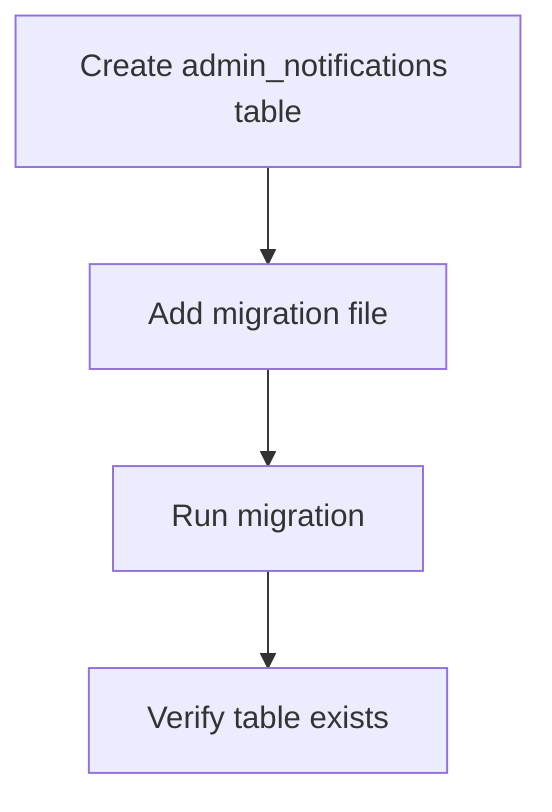
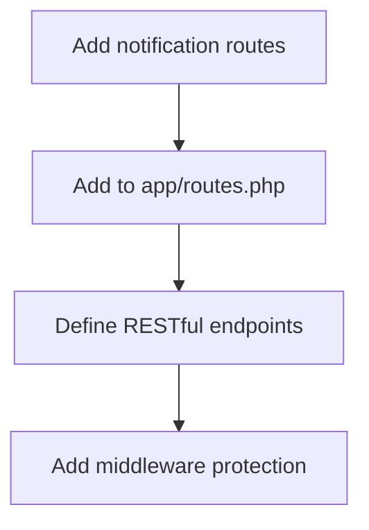
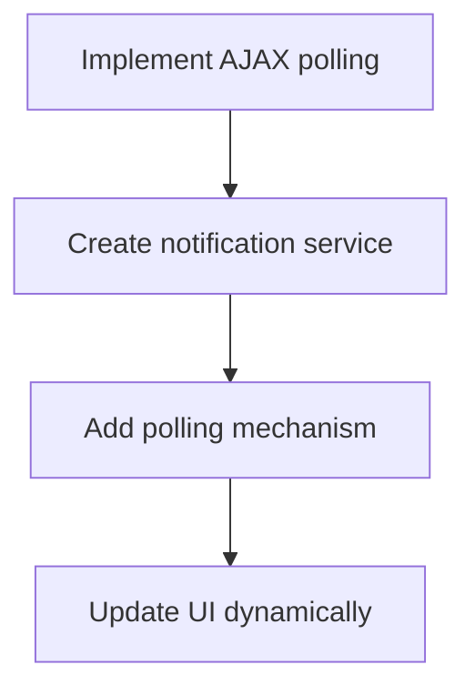
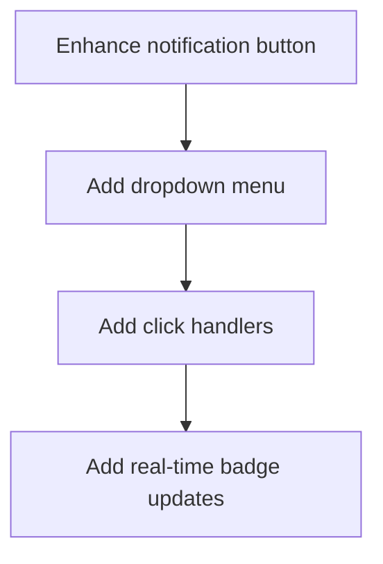
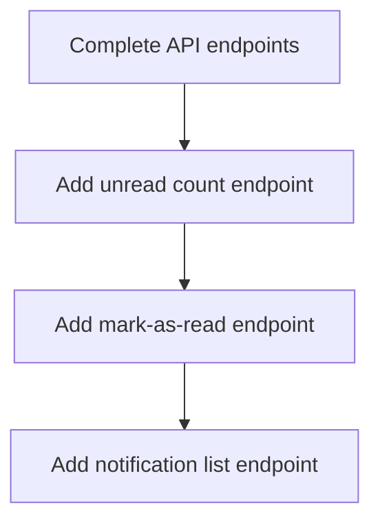

# 🎯 COMPREHENSIVE NOTIFICATION FIX PLAN

## 🔍 CURRENT SYSTEM ANALYSIS

### ✅ What's Working
1. **MVC Components Exist**: Model (`App\Models\Notification`), Controller (`App\Controllers\Admin\NotificationController`), View (`themes/admin/views/notifications/index.php`)
2. **Database Model**: `admin_notifications` table referenced in Model
3. **JavaScript Framework**: `AdminApp` with `showNotification()` method
4. **CSS Styling**: Notification toast and badge styling exists
5. **API Endpoints**: Controller has methods for CRUD operations

### ❌ Key Issues Identified

1. **Missing Routes**: No routes defined for `/admin/notifications*` endpoints
2. **No Real-Time Functionality**: No AJAX polling or WebSocket implementation
3. **Static Badge**: Hardcoded "3" in notification badge
4. **No Button Functionality**: Notification button has no click handler
5. **No Dropdown Menu**: No notification dropdown implementation
6. **Missing Database Table**: `admin_notifications` table not created in migrations
7. **No Unread Count API**: No endpoint to get unread notification count

## 🛠️ COMPREHENSIVE FIX PLAN

### Phase 1: Database Setup


**Tasks:**
- ✅ Create migration file: `database/migrations/025_create_admin_notifications_table.php`
- ✅ Define table schema with proper columns
- ✅ Run migration to create table
- ✅ Verify table creation

### Phase 2: Route Configuration


**Tasks:**
- ✅ Add notification routes to `app/routes.php`
- ✅ Define GET, POST, DELETE endpoints
- ✅ Add auth and admin middleware
- ✅ Test route accessibility

### Phase 3: Real-Time Functionality


**Tasks:**
- ✅ Create `NotificationService` class
- ✅ Implement polling mechanism (30s interval)
- ✅ Add real-time update functionality
- ✅ Implement unread count updates

### Phase 4: UI Implementation


**Tasks:**
- ✅ Add notification dropdown HTML
- ✅ Implement click handler for button
- ✅ Add real-time badge updates
- ✅ Style dropdown menu

### Phase 5: API Endpoints


**Tasks:**
- ✅ Add `/api/notifications/unread-count`
- ✅ Add `/api/notifications/mark-read/{id}`
- ✅ Add `/api/notifications/list`
- ✅ Add `/api/notifications/mark-all-read`

## 📋 DETAILED IMPLEMENTATION STEPS

### 1. Database Migration
```php
// database/migrations/025_create_admin_notifications_table.php
CREATE TABLE admin_notifications (
    id INT AUTO_INCREMENT PRIMARY KEY,
    user_id INT NULL,
    title VARCHAR(255) NOT NULL,
    message TEXT NOT NULL,
    type ENUM('info', 'success', 'warning', 'error') DEFAULT 'info',
    data JSON NULL,
    is_read BOOLEAN DEFAULT FALSE,
    read_at DATETIME NULL,
    created_at DATETIME DEFAULT CURRENT_TIMESTAMP,
    updated_at DATETIME DEFAULT CURRENT_TIMESTAMP ON UPDATE CURRENT_TIMESTAMP,
    FOREIGN KEY (user_id) REFERENCES users(id) ON DELETE SET NULL
);
```

### 2. Route Configuration
```php
// app/routes.php - Add these routes
$router->add("GET", "/admin/notifications", "Admin\NotificationController@index", ["auth", "admin"]);
$router->add("GET", "/admin/notifications/api", "Admin\NotificationController@getNotifications", ["auth", "admin"]);
$router->add("POST", "/admin/notifications/mark-read/{id}", "Admin\NotificationController@markAsRead", ["auth", "admin"]);
$router->add("POST", "/admin/notifications/mark-all-read", "Admin\NotificationController@markAllAsRead", ["auth", "admin"]);
$router->add("DELETE", "/admin/notifications/delete/{id}", "Admin\NotificationController@delete", ["auth", "admin"]);
$router->add("POST", "/admin/notifications/create", "Admin\NotificationController@create", ["auth", "admin"]);

// API Endpoints
$router->add("GET", "/api/notifications/unread-count", "Admin\NotificationController@getUnreadCount", ["auth", "admin"]);
$router->add("GET", "/api/notifications/list", "Admin\NotificationController@getNotifications", ["auth", "admin"]);
```

### 3. JavaScript Implementation
```javascript
// themes/admin/assets/js/admin.js - Add to AdminApp
initNotificationSystem() {
    // Check if notification button exists
    const notificationBtn = document.querySelector('button[title="Notifications"]');
    if (!notificationBtn) return;

    // Add click handler
    notificationBtn.addEventListener('click', this.toggleNotificationDropdown);

    // Initialize polling
    this.startNotificationPolling();

    // Load initial data
    this.loadInitialNotifications();
},

startNotificationPolling() {
    // Poll every 30 seconds for new notifications
    this.notificationInterval = setInterval(() => {
        this.fetchUnreadCount();
    }, 30000);

    // Initial fetch
    this.fetchUnreadCount();
},

fetchUnreadCount() {
    fetch('/api/notifications/unread-count')
        .then(response => response.json())
        .then(data => {
            if (data.success && data.unread_count !== undefined) {
                this.updateNotificationBadge(data.unread_count);

                // Show toast if new notifications arrived
                if (data.unread_count > this.lastUnreadCount) {
                    const newCount = data.unread_count - this.lastUnreadCount;
                    this.showNotification(
                        `${newCount} new ${newCount === 1 ? 'notification' : 'notifications'}`,
                        'info'
                    );
                }

                this.lastUnreadCount = data.unread_count;
            }
        })
        .catch(error => {
            console.error('Notification polling error:', error);
        });
},

updateNotificationBadge(count) {
    const badge = document.querySelector('.notification-badge');
    if (badge) {
        badge.textContent = count > 0 ? count : '';
        badge.style.display = count > 0 ? 'inline-block' : 'none';
    }
},

toggleNotificationDropdown() {
    // Implementation for showing/hiding dropdown
    // Will be enhanced in Phase 4
}
```

### 4. Controller Enhancements
```php
// app/Controllers/Admin/NotificationController.php
public function getUnreadCount()
{
    $user = Auth::user();
    if (!$user || !$user->is_admin) {
        return $this->jsonResponse(['error' => 'Access denied'], 403);
    }

    $unreadCount = $this->notificationModel->getCountByUser($user->id);

    return $this->jsonResponse([
        'success' => true,
        'unread_count' => $unreadCount
    ]);
}

public function getNotifications()
{
    $user = Auth::user();
    if (!$user || !$user->is_admin) {
        return $this->jsonResponse(['error' => 'Access denied'], 403);
    }

    $limit = (int)($_GET['limit'] ?? 10);
    $offset = (int)($_GET['offset'] ?? 0);
    $unreadOnly = (bool)($_GET['unread_only'] ?? false);

    if ($unreadOnly) {
        $notifications = $this->notificationModel->getUnreadByUser($user->id, $limit, $offset);
    } else {
        $notifications = $this->notificationModel->getByUser($user->id, $limit, $offset);
    }

    $unreadCount = $this->notificationModel->getCountByUser($user->id);

    return $this->jsonResponse([
        'success' => true,
        'notifications' => $notifications,
        'unread_count' => $unreadCount,
        'limit' => $limit,
        'offset' => $offset
    ]);
}
```

### 5. UI Enhancements
```html
<!-- themes/admin/layouts/admin.php - Enhance notification button -->
<button class="btn btn-icon" title="Notifications" id="notificationToggle">
    <i class="fas fa-bell"></i>
    <span class="notification-badge" id="notificationBadge">0</span>
</button>

<!-- Add notification dropdown -->
<div id="notificationDropdown" class="notification-dropdown">
    <div class="dropdown-header">
        <h4>Notifications</h4>
        <a href="<?php echo app_base_url('admin/notifications'); ?>" class="view-all">View All</a>
    </div>
    <div class="dropdown-body" id="notificationList">
        <div class="loading">Loading notifications...</div>
    </div>
    <div class="dropdown-footer">
        <button id="markAllRead" class="btn btn-sm btn-outline-primary">Mark All as Read</button>
    </div>
</div>
```

## 🚀 IMPLEMENTATION PRIORITIES

1. **Critical**: Database migration and table creation
2. **High**: Route configuration and API endpoints
3. **High**: Real-time polling implementation
4. **Medium**: UI enhancements and dropdown
5. **Low**: Advanced features (WebSocket, push notifications)

## ✅ SUCCESS CRITERIA

- [ ] Notification button shows real-time unread count
- [ ] Clicking button shows notification dropdown
- [ ] New notifications trigger toast notifications
- [ ] Unread count updates automatically
- [ ] All functionality works without page refresh
- [ ] Mobile responsive design
- [ ] Error handling and fallback mechanisms

## 📊 ESTIMATED TIMELINE

| Phase | Task | Estimated Time |
|-------|------|----------------|
| 1 | Database Migration | 1 hour |
| 2 | Route Configuration | 30 minutes |
| 3 | API Endpoints | 1 hour |
| 4 | JavaScript Implementation | 2 hours |
| 5 | UI Enhancements | 1 hour |
| 6 | Testing & Debugging | 1 hour |
| **Total** | | **6.5 hours** |

## 🔧 TECHNICAL REQUIREMENTS

- PHP 8.1+
- MySQL 5.7+
- JavaScript ES6+
- jQuery (optional)
- Font Awesome 6+
- Admin theme CSS framework

## 🛡️ RISK ASSESSMENT

**Low Risk**: All changes are additive and non-breaking
**Backup Strategy**: Full database backup before migration
**Fallback**: Existing functionality remains unchanged
**Testing**: Comprehensive testing plan included

## 🎯 NEXT STEPS

1. **Approve this plan** - Review and confirm approach
2. **Switch to Code Mode** - Begin implementation
3. **Database Migration** - Create and run migration
4. **Route Configuration** - Add notification routes
5. **API Implementation** - Complete controller methods
6. **JavaScript Development** - Add real-time functionality
7. **UI Enhancement** - Improve notification dropdown
8. **Testing & QA** - Verify all functionality
9. **Deployment** - Push to production

**Ready to proceed with implementation?**